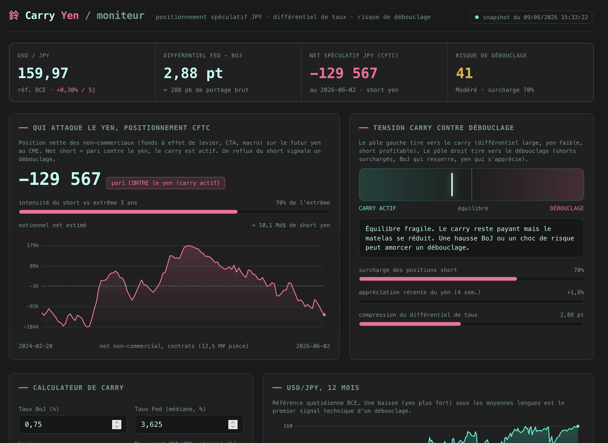

# Carry Yen (YCT)

Language: **English** · [Français](README.fr.md)

A web dashboard that watches the yen carry trade and answers, at a glance, one simple question: are CFTC non-commercial traders still betting against the yen, and is the risk of a violent reversal rising?

Live demo: https://yct.l0g.fr/en/



## In short, no expertise required

The carry trade means borrowing in a currency where interest rates are very low (the Japanese yen, near zero) and investing in one where they pay more (the US dollar). As long as the yen stays weak, you pocket the rate difference, month after month. It is a popular cash machine for large funds.

The catch: that difference is earned on credit and with leverage. If the yen suddenly rises, everyone wants to repay at once, the yen climbs even faster, and positions blow up in a chain reaction. That is exactly what happened in August 2024: in three weeks the yen surged and stock markets tumbled. This is called an unwind.

This dashboard measures three things to gauge where we stand:

- How profitable the bet against the yen is today (the rate gap between the United States and Japan).
- How large the broad CFTC Legacy non-commercial position against the yen is, and whether that position is already extreme.
- Whether the yen is starting to strengthen, the first sign of a possible unwind.

It turns this into a risk reading from 0 to 100 and a plain verdict. This is not investment advice, it is a thermometer.

## How to read the dashboard

- USD/JPY: the price of the dollar in yen. When it rises, the yen weakens and the carry trade works. When it falls, the yen strengthens, be careful.
- Fed minus BoJ differential: the rate gap. The wider it is, the more the bet pays.
- JPY non-commercial net: long minus short contracts in the broad CFTC Legacy non-commercial category. It is not the narrower TFF leveraged-funds category.
- TFF leveraged funds: a second view of the same CME contract, displayed separately and never merged with Legacy.
- Unwind risk: the summary. Low, Moderate, Elevated, or Critical.
- The carry versus unwind gauge: needle on the left, carry dominates, calm. On the right, the ground gets dangerous.

## Where the numbers come from

Everything comes from official, public, free sources. The original source is always preferred over a site that copies it.

| Field | Official source |
|---|---|
| Who bets against the yen | CFTC, the US futures regulator (weekly positioning report) |
| Leveraged-fund positions | CFTC TFF Futures Only, kept as a distinct series |
| USD/JPY price | European Central Bank (daily reference rates) |
| US policy rate | Federal Reserve via the FRED database |
| Japan policy rate | Dated config, verified after each Bank of Japan decision |

## Trust and privacy

The dashboard is built to be sober and respectful:

- No ads, no trackers, no cookies.
- Your browser contacts no third-party service. The server prepares data and status JSON files, then the browser reads them from the YCT domain. Data providers never see your IP address.
- No key or secret is ever exposed.
- All the code is open, you can read and verify it.

## Architecture, for the technical reader

Transactional snapshot design. A scheduled job checks the sources several times a day. It replaces `data.json` only after complete validation; `status.json` describes every attempt and optional Massive data is kept separately in `market.json`.

```
  systemd timer (4 times per day)
        |
        v
  build_snapshot.py  --(HTTPS)-->  CFTC Legacy/TFF + ECB Data API + FRED
        |
        +--> candidate.json --> validation --> data.json
        +--> status.json
        +--> market.json (optional Massive quote)
        ^
        | read-only JSON aliases
  Apache 443  -->  web/index.html + web/en/index.html + app.css + app.js
        ^
        | HTTPS, CSP default-src 'none'
     visitor (only reads the YCT origin)
```

If a required source is down, `data.json` does not change. The page keeps the last fully healthy snapshot and shows the failed attempt from `status.json`. If observations are unchanged, `data.json` remains byte-for-byte stable.

### Note on the CFTC data

Both Legacy and TFF queries filter directly on CFTC contract market code `097741`, the standard CME Japanese-yen future. Each requires exactly 170 complete weekly rows and the report week expected from the official CFTC calendar. The categories stay separate.

### Risk score, the formula

Score from 0 (carry dominant) to 100 (unwind), recomputed in the browser:

- Short crowding, weight 0.45: current net relative to its roughly three-year extreme.
- Yen appreciation over four weeks, weight 0.35: a strengthening yen raises the risk.
- Rate-gap compression, weight 0.20: the smaller the gap, the thinner the cushion.

Bands: Low (under 30), Moderate (30 to 55), Elevated (55 to 78), Critical (78 and above). Notional is estimated as net contracts times 12,500,000 yen, converted with the ECB reference. Formula `1.0.0` is explicitly identified as a non-backtested heuristic.

## Repository layout

```
web/index.html web/en/index.html        French and English application routes
web/app.css web/app.js                  shared presentation and bilingual logic
web/data.json                            demo sample (synthetic)
build_snapshot.py                        snapshot builder, Python stdlib only
yct_quality.py                           shared calendars and quality contracts
config/source-calendars.json             versioned official CFTC and BoJ calendars
config/boj-policy.json                   single public contract for BoJ rate, date and decision
verify_snapshot.py                       validates schema, grain and freshness
verify_live.py                           compares HTTPS assets with the local bundle
gen_sample.py                            regenerates the demo sample
env.example                              local-options template (no secret)
deploy/yct-snapshot.service              hardened systemd unit
deploy/yct-snapshot.timer                scheduled trigger
deploy/yct.l0g.fr.conf                   hardened Apache vhost example
tools/release.py                         exact artifact, checksums and secret scanning
RUNBOOK.md                               detailed deployment runbook (French)
tests/test_yct.py                         regression tests for source and freshness contracts
.github/workflows/test.yml               minimal CI contract checks
```

## Try it locally, no server

```bash
python3 gen_sample.py          # generates web/data.json (sample)
cd web && python3 -m http.server 8000
# then open http://localhost:8000
```

The public version keeps every provider request server-side. The French `/` and English `/en/` routes read the same canonical same-origin JSON; neither variant automatically contacts those services from the browser.

## Production deployment

Full step-by-step procedure in [RUNBOOK.md](RUNBOOK.md) (French). In short: a dedicated system user, the builder under a hardened systemd timer, a static Apache vhost with strict CSP and a Let's Encrypt certificate. Requirements: Debian, Apache 2 (ssl, headers, rewrite), Python 3.12 or newer (CI covers 3.12, 3.13 and 3.14), and a DNS record.

## Disclaimer

Information and analysis tool. Nothing here is investment, financial, or tax advice. The carry trade carries a risk of loss, amplified by leverage and currency moves. Do your own research.

## License

MIT. See [LICENSE](LICENSE).
